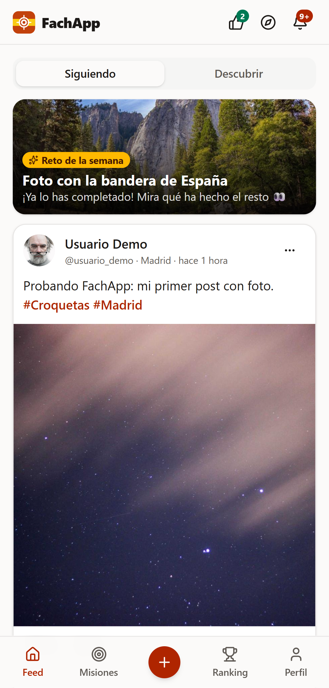
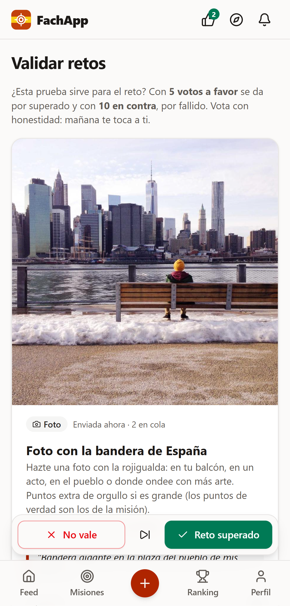
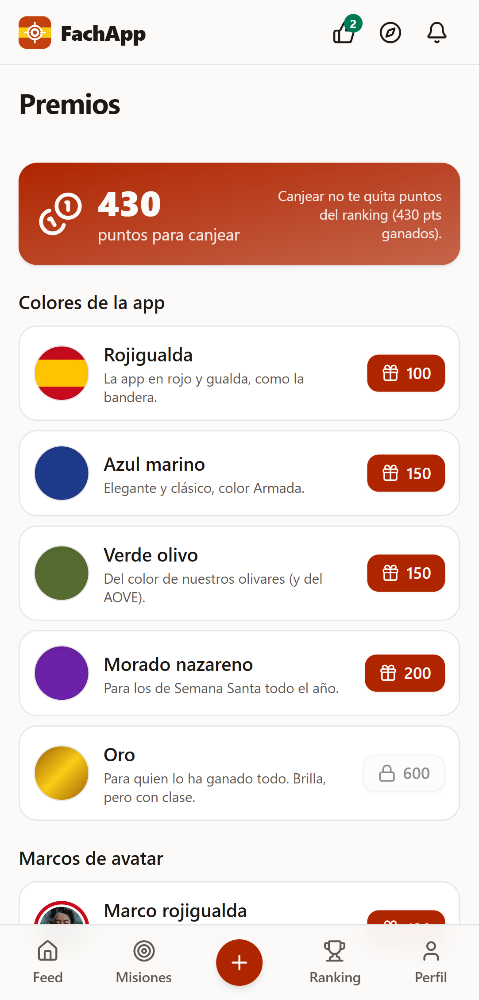
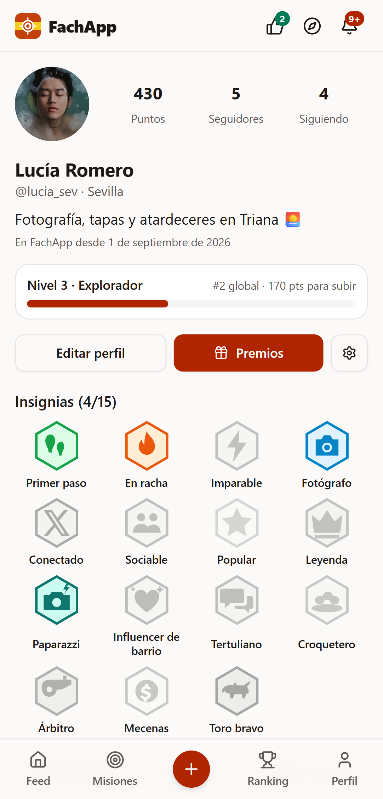
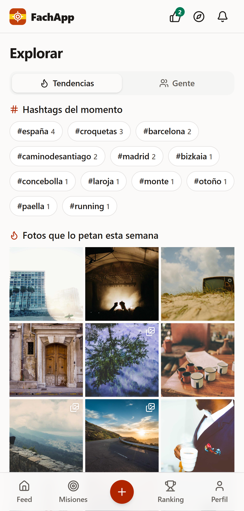

# FachApp

Red social web (PWA) enfocada en España: completa **misiones**, demuéstralo (automáticamente con tu cuenta de **X** o subiendo una **foto**), compártelo con tus amigos y sube en el **ranking**. Preparada para convertirse en app de Android/iOS con **Capacitor**.

| Feed                               | Validar retos                            | Premios                                  | Perfil                                 | Explorar                                   |
| ---------------------------------- | ---------------------------------------- | ---------------------------------------- | -------------------------------------- | ------------------------------------------ |
|  |  |  |  |  |

Más capturas en [`docs/capturas`](docs/capturas). Plan y estado por fases en [`docs/PLAN.md`](docs/PLAN.md); arquitectura y modelo de datos en [`docs/arquitectura.md`](docs/arquitectura.md).

## Funcionalidades

- **Retos de temática española** (31 de serie, en [`scripts/missions-data.mjs`](scripts/missions-data.mjs)): foto con la bandera (Reto de la semana), selfie con alguien del PP, #España y #12deOctubre en X, desfile del 12 de Octubre, Día de la Constitución, La Roja, Camino de Santiago, toro de Osborne, Patrimonio de la Humanidad, tortilla, paella, jamón, fiestas del pueblo, lotería de Navidad… Verificación por `photo`, `manual` o `x_auto` (automática con X). Los admins crean retos desde la app, con foto de portada.
- **Validación por la comunidad**: las pruebas pendientes se enseñan a usuarios al azar en **Validar retos**. Con **5 votos "Reto superado"** se da por superado y con **10 "No vale"**, por fallido. Los admins pueden decidir directamente.
- **Premios**: los puntos se canjean por **colores de la app**, **marcos de avatar**, **títulos** e **insignias exclusivas**. Canjear no resta puntos del ranking.
- **Cuentas**: email + contraseña, enlace mágico, Google y X (OAuth 2.0). Onboarding con usuario, provincia y **edad mínima de 14 años** (LOPDGDD).
- **Integración con X** solo desde Edge Functions: consentimiento RGPD, OAuth 2.0 + PKCE, tokens cifrados (AES-GCM), evaluador de reglas con tests, **caché de 15 min** y **límite diario** por usuario, **modo mock**.
- **Red social**: seguir, feed _Siguiendo_/_Descubrir_ con scroll infinito, publicaciones con **hasta 4 fotos en carrusel**, **doble toque para dar me gusta**, visor de fotos a pantalla completa, **galería en cada perfil**, comentarios, **#hashtags y @menciones**, **Explorar** (fotos en tendencia, hashtags del momento, gente) y **notificaciones en tiempo real**.
- **Gamificación**: puntos, niveles, 15 insignias SVG propias (Paparazzi, Croquetero, Árbitro…), ranking global / semanal / amigos / provincia.
- **Moderación**: reportar, bloquear, filtro de lenguaje ofensivo (cliente + BD), normas de la comunidad.
- **Panel admin**: pruebas pendientes, misiones (con portada y Reto de la semana), reportes y usuarios (dar o quitar admin).
- **RGPD**: exportar mis datos (JSON), borrar cuenta, desconectar X, política de privacidad. Sin cookies de analítica → sin banner.
- **Calidad**: PWA instalable, modo claro/oscuro, WCAG AA (axe), Lighthouse > 90, **86 tests unitarios y 25 E2E** que GitHub Actions ejecuta en cada push.

## Qué falta (fases pendientes)

Todo el código de las fases 0-7 está hecho y probado. Lo pendiente depende de cuentas o herramientas que tienes que crear tú:

| Pendiente                                             | Qué hace falta                                                           | Dónde                                                                        |
| ----------------------------------------------------- | ------------------------------------------------------------------------ | ---------------------------------------------------------------------------- |
| **Publicar la web para tus amigos**                   | Proyecto de Supabase en la nube + activar GitHub Pages + 2 secrets       | [Publicar la versión web](#publicar-la-versión-web-para-probarla-con-amigos) |
| Login con Google                                      | Credenciales OAuth en Google Cloud                                       | [§3](#3-login-con-google)                                                    |
| Misiones de X con datos reales (ahora en modo prueba) | App en developer.x.com (leer posts es de pago)                           | [§4](#4-app-de-x-developerxcom)                                              |
| Push reales en el móvil                               | Proyecto de Firebase                                                     | [§5](#5-app-móvil-capacitor)                                                 |
| App en Google Play / App Store (Fase 7)               | Firmar el AAB; iOS necesita un Mac con Xcode                             | [§5](#5-app-móvil-capacitor)                                                 |
| Fotos de portada reales de los retos                  | Subirlas desde "Nuevo reto" / panel admin (ahora son imágenes genéricas) | App                                                                          |
| Revisión legal de privacidad y términos               | Un profesional                                                           | `apps/web/src/features/settings/legal-pages.tsx`                             |

## Stack

React 19 · TypeScript · Vite · Tailwind CSS v4 · shadcn/ui · lucide-react · React Router (HashRouter) · TanStack Query · Zustand · react-hook-form + zod · vite-plugin-pwa · Supabase (Postgres + RLS, Auth, Storage, Realtime, Edge Functions) · Vitest + Testing Library · Playwright + axe · ESLint + Prettier + Husky · GitHub Actions → GitHub Pages · Capacitor.

## Estructura

```
fachapp/
├─ apps/web/
│  ├─ src/
│  │  ├─ features/        # auth, missions, feed, profile, social, ranking, notifications, x, settings, admin
│  │  ├─ components/ui/   # componentes shadcn
│  │  ├─ lib/             # supabase, tipos generados, i18n (es-ES), imágenes, niveles, nativo…
│  │  └─ routes/          # router (HashRouter + carga diferida)
│  ├─ e2e/                # Playwright: flujos, accesibilidad y capturas
│  ├─ android/ ios/       # proyectos nativos (Capacitor)
│  └─ assets/             # icono y splash fuente para Capacitor
├─ supabase/
│  ├─ migrations/         # esquema por fases (RLS en todas las tablas)
│  ├─ functions/          # x-oauth-start, x-oauth-callback, x-verify, x-disconnect, send-push + _shared
│  ├─ docker/             # Supabase local con Docker (alternativa a `supabase start`)
│  └─ seed.sql            # 10 misiones, 7 usuarios demo y actividad
├─ scripts/               # sb.mjs (Supabase local), icons.mjs, lighthouse.mjs, android-apk.mjs
├─ docs/                  # plan, arquitectura (Mermaid), capturas
└─ .github/workflows/     # ci.yml, deploy.yml
```

## Puesta en marcha (local)

Requisitos: **Node 22** y **Docker Desktop**.

```bash
npm install
npm run db:reset     # genera claves locales, levanta Supabase en Docker, migra y siembra (1.ª vez: varios minutos)
npm run dev          # http://localhost:5180/fachapp/
```

Cuentas demo (contraseña `fachapp123`, solo en local): **`usuario@fachapp.local`** (usuario normal) y **`admin@fachapp.local`** (administrador), con botones de acceso rápido en la pantalla de entrar. Además hay una comunidad de ejemplo: `lucia@`, `pablo@`, `marta@`, `javi@`, `sara@`, `dani@fachapp.local`.

| Servicio local             | URL                                                                             |
| -------------------------- | ------------------------------------------------------------------------------- |
| App                        | http://localhost:5180/fachapp/                                                  |
| API Supabase + Studio      | http://localhost:54321 (usuario/contraseña de Studio en `supabase/docker/.env`) |
| Postgres                   | `localhost:54322`                                                               |
| Emails de prueba (Mailpit) | http://localhost:54324                                                          |

> **¿Por qué Docker y no `supabase start`?** En este equipo el antivirus bloquea el binario del CLI de Supabase (`spawn EPERM`). `supabase/docker` es la versión recortada del [self-hosting oficial](https://github.com/supabase/supabase/tree/master/docker) y `scripts/sb.mjs` hace lo mismo que el CLI (migrar, sembrar, generar tipos). Si tienes el CLI funcionando, `supabase start` + `supabase db reset` también sirven: las migraciones y el seed son los mismos.

## Scripts

| Comando                                       | Qué hace                                                                                         |
| --------------------------------------------- | ------------------------------------------------------------------------------------------------ |
| `npm run dev` / `build` / `preview`           | Desarrollo (5180), build de producción, servir build (4180)                                      |
| `npm run lint` / `typecheck` / `format`       | ESLint, TypeScript, Prettier                                                                     |
| `npm test`                                    | Tests unitarios (Vitest), incluido el evaluador de reglas de X                                   |
| `npm run e2e`                                 | E2E con Playwright contra el Supabase local (en local usa Edge; `PW_CHANNEL=chrome` para Chrome) |
| `npm run docs:screens`                        | Regenera `docs/capturas`                                                                         |
| `npm run sb:start` / `sb:stop`                | Arranca/para Supabase en Docker                                                                  |
| `npm run db:migrate` / `db:seed` / `db:reset` | Migraciones, seed, reinicio completo                                                             |
| `npm run db:types`                            | Regenera `apps/web/src/lib/database.types.ts`                                                    |
| `npm run functions:check`                     | Comprueba los tipos de las Edge Functions con Deno (en Docker)                                   |
| `npm run android:apk -w @fachapp/web`         | Compila el APK de Android dentro de Docker (sin Android Studio)                                  |
| `npm run icons`                               | Genera iconos PNG (PWA y Capacitor) desde `logo.svg`                                             |
| `node scripts/lighthouse.mjs`                 | Auditoría Lighthouse del build (con `npm run preview` levantado)                                 |

## Variables de entorno

| Variable                         | Dónde                                    | Descripción                                                       |
| -------------------------------- | ---------------------------------------- | ----------------------------------------------------------------- |
| `VITE_SUPABASE_URL`              | `apps/web/.env.local` y GitHub Secrets   | URL del proyecto Supabase                                         |
| `VITE_SUPABASE_ANON_KEY`         | `apps/web/.env.local` y GitHub Secrets   | Anon key (pública por diseño; la seguridad la da RLS)             |
| `VITE_X_MOCK`                    | `apps/web/.env.local` / GitHub Variables | `true` muestra el aviso de modo prueba de X                       |
| `X_CLIENT_ID`, `X_CLIENT_SECRET` | `supabase secrets set`                   | App de developer.x.com                                            |
| `X_TOKEN_ENCRYPTION_KEY`         | `supabase secrets set`                   | 32 bytes en base64 (`openssl rand -base64 32`) para cifrar tokens |
| `X_MOCK`                         | `supabase secrets set`                   | `true` = no llama a la API de X (datos falsos)                    |
| `X_DAILY_LIMIT`                  | `supabase secrets set`                   | Verificaciones reales por usuario y día (por defecto 10)          |
| `X_OAUTH_REDIRECT_URI`           | `supabase secrets set`                   | `https://<proyecto>.supabase.co/functions/v1/x-oauth-callback`    |
| `APP_URL`                        | `supabase secrets set`                   | `https://<usuario>.github.io/fachapp/`                            |
| `FCM_SERVICE_ACCOUNT`            | `supabase secrets set`                   | JSON de la cuenta de servicio de Firebase (push); sin él, mock    |

En local todo esto lo genera `npm run sb:setup` en `supabase/docker/.env` y `apps/web/.env.local` (ignorados por git).

## Publicar la versión web para probarla con amigos

URL final: **https://ahernandez061.github.io/fachapp/** (repo `ahernandez061/fachapp`, público → GitHub Pages gratis).

1. **Supabase en la nube** (gratis): https://supabase.com → _New project_ → región _EU Central (Frankfurt)_ → guarda la contraseña de la BD.
2. **Esquema + misiones iniciales** (sin usuarios demo):
   ```bash
   # Supabase → botón "Connect" → "Session pooler" → copia la URI y pon tu contraseña
   SUPABASE_DB_URL="postgresql://postgres.<ref>:<contraseña>@aws-0-eu-central-1.pooler.supabase.com:5432/postgres" npm run cloud:migrate
   ```
3. **Auth** (Supabase → Authentication):
   - _URL Configuration_: Site URL `https://ahernandez061.github.io/fachapp/` y Redirect URL `https://ahernandez061.github.io/fachapp/**`.
   - _Sign In / Providers → Email_: para la prueba, **desactiva "Confirm email"** (el SMTP gratuito de Supabase solo envía unos pocos emails por hora).
4. **Edge Functions** (solo para las misiones de X; en modo prueba):
   ```bash
   # Token en https://supabase.com/dashboard/account/tokens ; ref = la parte <ref> de la URL del proyecto
   SUPABASE_ACCESS_TOKEN=sbp_… SUPABASE_PROJECT_REF=<ref> npm run cloud:functions
   ```
   Después, en _Edge Functions → Secrets_: `X_MOCK=true`, `X_TOKEN_ENCRYPTION_KEY=<openssl rand -base64 32>`, `APP_URL=https://ahernandez061.github.io/fachapp/`.
5. **GitHub** (repo → _Settings_):
   - _Pages_ → _Source_: **GitHub Actions**.
   - _Secrets and variables → Actions_: secrets `VITE_SUPABASE_URL` y `VITE_SUPABASE_ANON_KEY` (Supabase → _Project Settings → API_); variable `VITE_X_MOCK=true`.
6. **Publicar**: cada push a `main` lanza el workflow _Deploy a GitHub Pages_ (lint → tests → build → publicación, 1-2 minutos). Si ya hay código subido antes de configurar los pasos 5, ve a _Actions → Deploy a GitHub Pages → Run workflow_ para publicar sin esperar a otro push. En paralelo, el workflow _CI_ pasa todos los tests (unitarios + E2E con Supabase en Docker).
7. Regístrate en la web y hazte admin en Supabase → _SQL Editor_:
   `update public.profiles set is_admin = true where username = 'tu_usuario';`
   Desde la pestaña **Usuarios** del panel de admin puedes dar permisos a otros.

> **Grupo pequeño de amigos**: la validación comunitaria necesita 5 votos a favor (o 10 en contra). Si sois pocos, el admin puede aprobar desde _Administración → Pruebas_, o puedes bajar los umbrales cambiando `community_approvals_needed()` / `community_rejections_needed()` en el SQL Editor (por ejemplo `create or replace function public.community_approvals_needed() returns int language sql immutable as $$ select 3 $$;`).

> Los botones "Entrar como usuario/admin" **no aparecen** en la versión publicada (`VITE_DEMO_ACCOUNTS` solo se activa en local) y `seed.sql` nunca se carga en la nube.

## Configuración manual (lo que tienes que hacer tú)

### 1. Repositorio y GitHub Pages

1. Crea el repo **`fachapp`** en GitHub y súbelo (`git remote add origin … && git push -u origin main`).
2. **Settings → Pages → Build and deployment → Source: GitHub Actions**.
3. **Settings → Secrets and variables → Actions**:
   - _Secrets_: `VITE_SUPABASE_URL`, `VITE_SUPABASE_ANON_KEY`.
   - _Variables_ (opcional): `VITE_X_MOCK=true` mientras no tengas la app de X.
4. Cada push a `main` ejecuta `deploy.yml` (lint → tests → build → Pages). La app queda en `https://<usuario>.github.io/fachapp/`.

### 2. Supabase (producción)

1. https://supabase.com → **New project**, región **EU (Frankfurt o París)**.
2. Aplica el esquema: con el CLI `supabase link --project-ref <ref> && supabase db push`, o pega cada fichero de `supabase/migrations/` (en orden) en **SQL Editor**. **No** ejecutes `seed.sql` en producción (son datos demo).
3. **Authentication → URL Configuration**:
   - _Site URL_: `https://<usuario>.github.io/fachapp/`
   - _Redirect URLs_: `https://<usuario>.github.io/fachapp/**`, `http://localhost:5180/fachapp/**` y `es.fachapp.app://auth` (app móvil).
4. **Authentication → Providers → Email**: activa _Confirm email_. Configura un SMTP propio (**Project Settings → Auth → SMTP**) para no depender del límite de emails de Supabase.
5. **Edge Functions**: `supabase functions deploy x-oauth-start x-oauth-callback x-verify x-disconnect send-push` y luego `supabase secrets set X_CLIENT_ID=… X_CLIENT_SECRET=… X_TOKEN_ENCRYPTION_KEY=… X_MOCK=false APP_URL=… X_OAUTH_REDIRECT_URI=…`. `x-oauth-callback` se despliega sin verificación de JWT (ya está en `supabase/config.toml`).
6. **Push** (cuando publiques la app móvil): en **SQL Editor** crea los secretos que usa el trigger `dispatch_push`:
   ```sql
   select vault.create_secret('https://<proyecto>.supabase.co/functions/v1', 'functions_url');
   select vault.create_secret('<service_role key>', 'service_role_key');
   ```
   y `supabase secrets set FCM_SERVICE_ACCOUNT="$(cat cuenta-servicio-firebase.json)"`. Sin ellos no se envía push (las notificaciones dentro de la app funcionan igual).
7. Hazte admin: en **SQL Editor** `update public.profiles set is_admin = true where username = 'tu_usuario';`
8. Copia _Project URL_ y _anon public key_ (**Project Settings → API**) a los GitHub Secrets.

### 3. Login con Google

1. https://console.cloud.google.com → **APIs y servicios → Pantalla de consentimiento OAuth** (externa, nombre FachApp, dominio `github.io`).
2. **Credenciales → Crear ID de cliente OAuth → Aplicación web**. _URI de redirección autorizada_: `https://<proyecto>.supabase.co/auth/v1/callback`.
3. En Supabase, **Authentication → Providers → Google**: pega _Client ID_ y _Client secret_.

### 4. App de X (developer.x.com)

Se usa para dos cosas: el **login con X** (lo gestiona Supabase Auth) y la **conexión de lectura para misiones** (la gestionan las Edge Functions). Puede ser la misma app.

1. https://developer.x.com → **Projects & Apps** → crea un proyecto y una app. Elige un plan con acceso de lectura a la API v2 (leer posts consume créditos: ajusta `X_DAILY_LIMIT`).
2. **User authentication settings**: OAuth **2.0**, tipo **Web App (confidential client)**, permisos **Read** (nunca Write).
3. _Callback URIs_ (ambas):
   - `https://<proyecto>.supabase.co/auth/v1/callback` (login con X)
   - `https://<proyecto>.supabase.co/functions/v1/x-oauth-callback` (conexión para misiones)
4. _Website URL_: `https://<usuario>.github.io/fachapp/`.
5. Copia _Client ID_ y _Client Secret_ a **Supabase → Authentication → Providers → X / Twitter (OAuth 2.0)** y a los secrets de las Edge Functions (`X_CLIENT_ID`, `X_CLIENT_SECRET`).
6. Scopes que pide FachApp: `tweet.read users.read offline.access`. Nunca publica en nombre del usuario.

### 5. App móvil (Capacitor)

```bash
npm run cap:android -w @fachapp/web   # build nativo + sync + abre Android Studio
npm run cap:ios -w @fachapp/web       # (en macOS con Xcode)
npm run android:apk -w @fachapp/web   # APK de depuración compilado en Docker, sin instalar nada
```

- Android sin Android Studio: `android:apk` usa `apps/web/android.Dockerfile` (JDK 21 + Android SDK 36) y deja el APK en `apps/web/android/app/build/outputs/apk/debug/app-debug.apk`. Antes, pon en `apps/web/.env.local` una URL de Supabase accesible desde el móvil (no `localhost`).
- Android para Google Play: Android Studio → **Build → Generate Signed Bundle** (AAB firmado).
- iOS: requiere macOS + Xcode (los plugins usan Swift Package Manager, no hace falta CocoaPods).
- Push: crea un proyecto en **Firebase**, añade `google-services.json` en `apps/web/android/app/` y sube la clave APNs a Firebase para iOS. Los tokens se guardan en `push_tokens`; al crearse una notificación, el trigger `dispatch_push` llama a la Edge Function `send-push`, que envía por FCM (HTTP v1) y borra los tokens caducados. Sin `FCM_SERVICE_ACCOUNT` funciona en modo mock (solo log).
- Iconos y splash: `npm run icons && npx @capacitor/assets generate` (fuentes en `apps/web/assets`).

## Seguridad y legal (España / UE)

- **RLS** en todas las tablas; puntos, validaciones e insignias se calculan en la BD (triggers / RPC `security definer`), nunca en el cliente.
- Los tokens de X solo existen cifrados en `x_accounts`, tabla sin acceso para `anon`/`authenticated`.
- RGPD: consentimiento explícito para X, explicación de los datos leídos, exportación JSON, borrado de cuenta y desconexión de X. Edad mínima 14 años (LOPDGDD).
- Moderación: reportes, bloqueos, filtro de lenguaje ofensivo en cliente y en triggers de BD. Las misiones no pueden consistir en acosar, mencionar en masa ni atacar a otras personas.
- Secretos solo en GitHub Secrets y Supabase; `.env.example` sin valores reales.
- Los textos legales son **provisionales**: revísalos con un profesional antes de lanzar.
