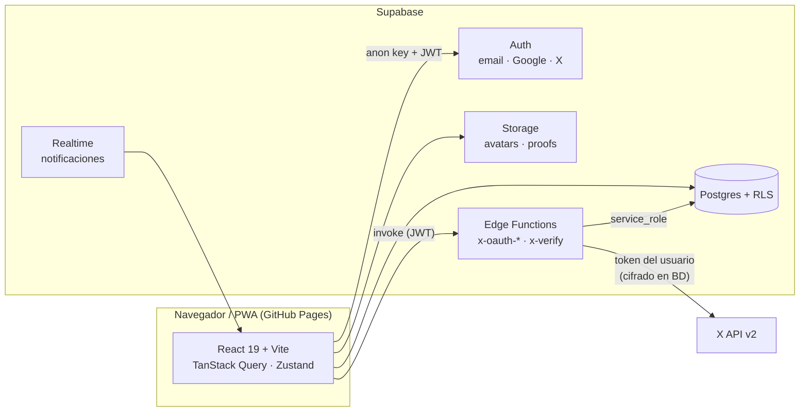
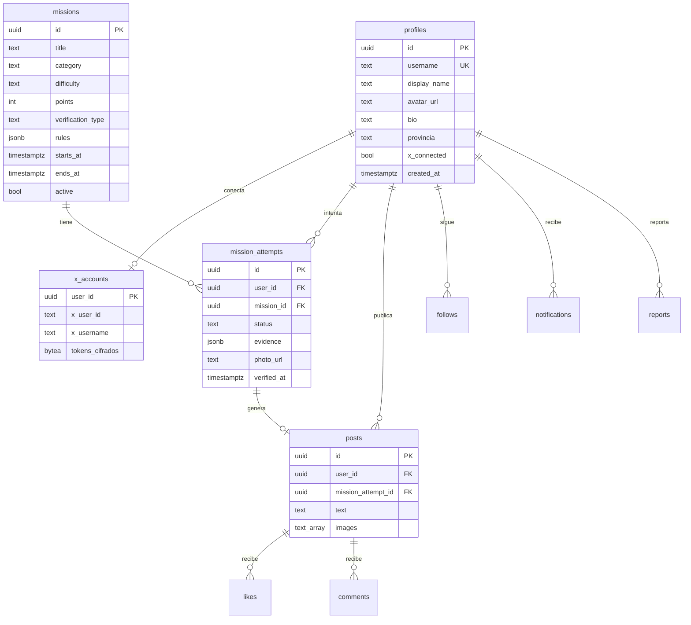

# Arquitectura

Principios:

- El frontend **nunca** ve tokens de X ni la `service_role` key; solo la anon key (pública) + el JWT del usuario.
- Toda la autorización vive en **Row Level Security**. Los puntos y la verificación se calculan en BD / Edge Functions, nunca en el cliente.
- Rutas con `HashRouter` porque GitHub Pages no reescribe URLs.

## Modelo de datos (previsto)

