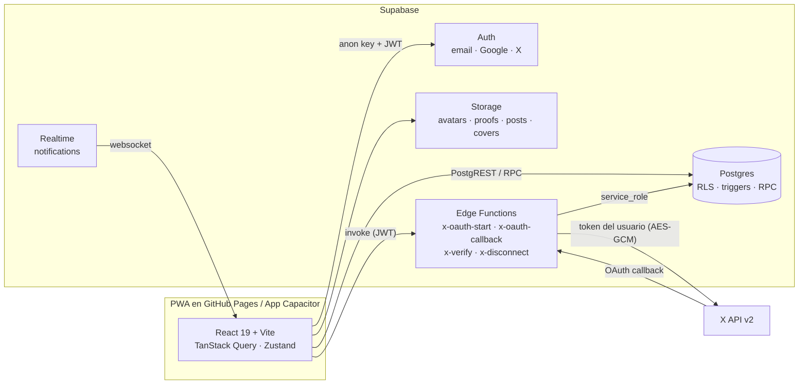
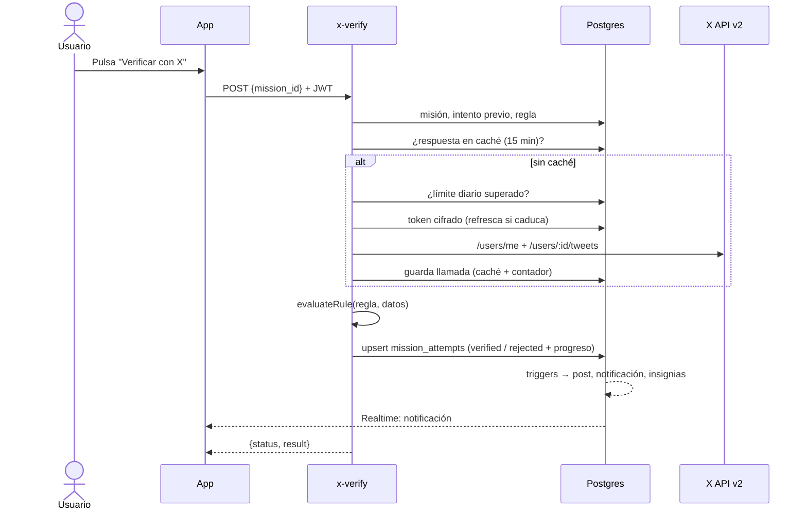
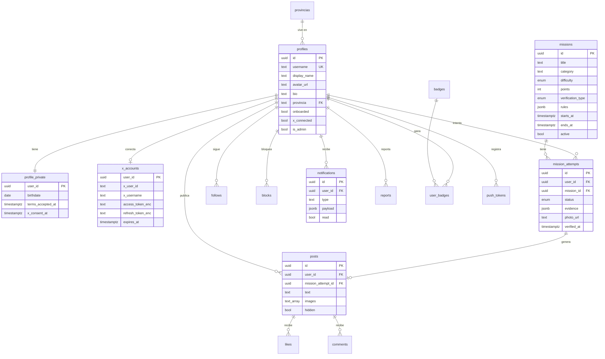

# Arquitectura

Principios:

- El frontend **nunca** ve tokens de X ni la `service_role` key; solo la anon key (pública) + el JWT del usuario.
- Toda la autorización vive en **Row Level Security**. Puntos, validaciones, posts automáticos, notificaciones e insignias se calculan en la BD.
- Rutas con `HashRouter` porque GitHub Pages no reescribe URLs; los OAuth vuelven a la raíz (`?code=` antes del `#`) con flujo PKCE.

## Flujo de una misión `x_auto`

## Modelo de datos

Vistas y RPC: `post_feed`, `leaderboard`, `get_feed`, `get_leaderboard`, `get_profile_stats`, `complete_onboarding`, `submit_attempt`, `review_attempt`, `export_my_data`, `delete_my_account`.
